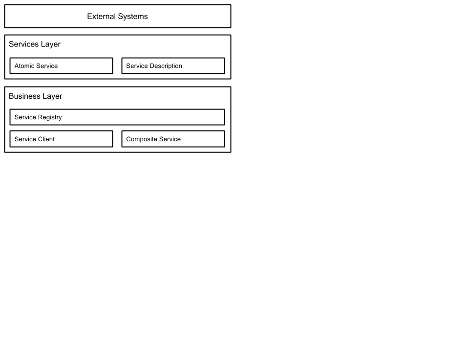
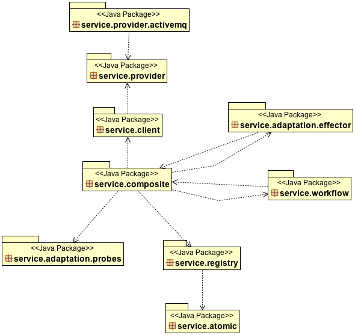
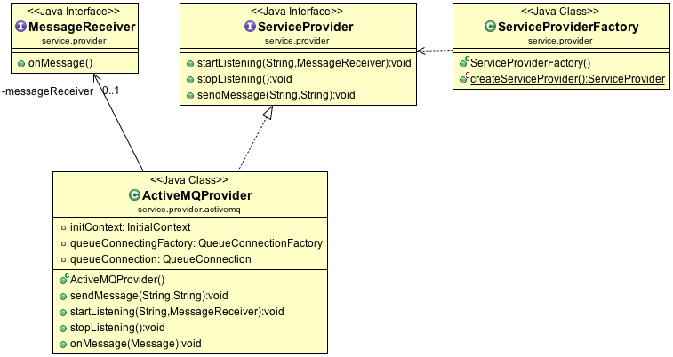
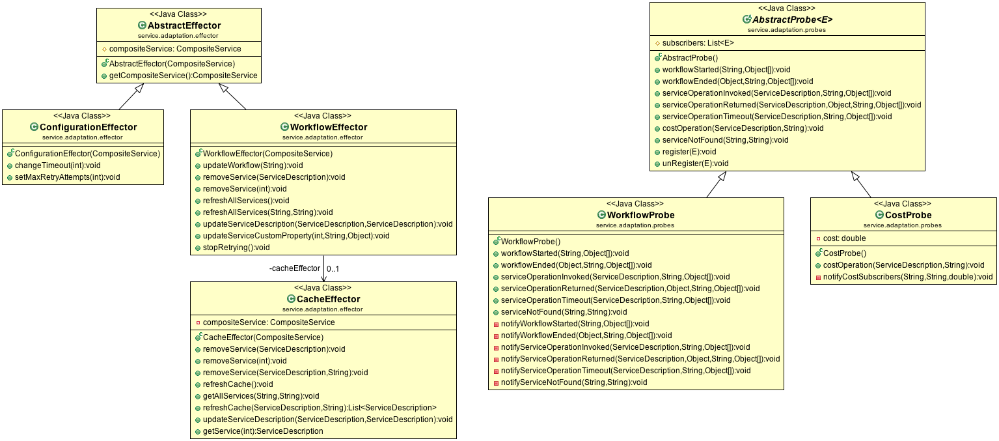
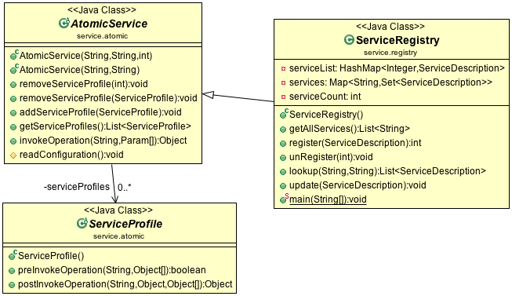

# ReSeP

> Software Architecture Document (SAD)

## 1. Documentation Roadmap

### 1.1. How the SAD is Organized

This SAD is organized in three views, layered, logical and generalization view.
The layered view describes how the whole system is structured in layers and
serves as an introduction. The logical view describes the most important classes
and their organization in packages. The generalization view shows inheritance relations.

### 1.2. Stakeholder Representation

The stakeholders and the view of interest to them:

* Owner, layered view
* Architect, layered and generalization view
* Developer, logical and generalization view

### 1.3. How a View is Documented

## 2. Views

### 2.1. Layered View

#### 2.1.1. View Description

The layered view describes how the whole system is structured in layers and
serves as an introduction.

#### 2.1.2. View Packets

Atomic services har en egen funktionalitet som inte är beroende av andra services.

En service description innehåller information om en service. Bland annat namn,
a list of supported operations, address.

Composite services är andra services ihopkopplade baserat på ett workflow, som
förklarar hur services ska how to compose them.
En workflow engine används för att execute the workflow.

Service registry används för att registrera och lookup services med hjälp av en
service description.

### 2.2. Logical View

#### 2.2.1. View Description

The logical view describes the most important classes and their organization in
packages.

#### 2.2.2. View Packets

##### 2.2.2.1. Packages

Providers are in the package `service.provider` and `service.provider.activemq`.
Composites and Atomics are in the package `service.composite` and
`service.atomic`.
Effectors and Probes are in the package `service.adaptation.effector` and
`service.adaptation.probes`.

##### 2.2.2.2. Provider

##### 2.2.2.3. Adaptation

* *AbstractEffecter*
* *AbstractProbe*

##### 2.2.2.4. Composite

##### 2.2.2.5. Atomic

### 2.3. Generalization View

#### 2.3.1. View Description

The generalization view allows capturing inheritance relations, such as
commonalities and differences between different elements.

#### 2.3.2. View Packets
