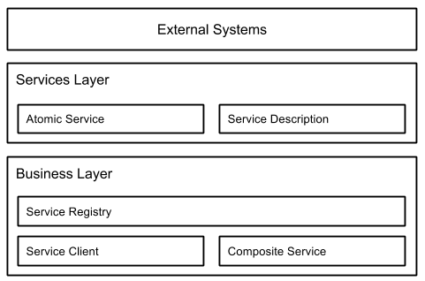
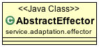
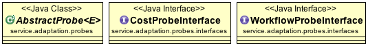
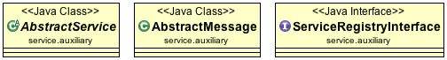

# ReSeP

> Software Architecture Document (SAD)

## 1. Documentation Roadmap

### 1.1. How the SAD is Organized

This SAD is organized in three views, layered, logical and generalization view.
The layered view describes how the whole system is structured in layers and
serves as an introduction. The logical view describes the most important classes
and their organization in packages. The generalization view shows inheritance relations.

### 1.2. Stakeholder Representation

The stakeholders and the view of interest to them:

* Owner, layered view
* Architect, layered and generalization view
* Developer, logical and generalization view

### 1.3. How a View is Documented

## 2. Views

### 2.1. Layered View

#### 2.1.1. View Description

The layered view describes how the whole system is structured in layers and
serves as an introduction.

#### 2.1.2. View Packets

Atomic services har en egen funktionalitet som inte är beroende av andra services.

En service description innehåller information om en service. Bland annat namn,
a list of supported operations, address.

Composite services är andra services ihopkopplade baserat på ett workflow, som
förklarar hur services ska how to compose them.
En workflow engine används för att execute the workflow.

Service registry används för att registrera och lookup services med hjälp av en
service description.

### 2.2. Logical View

#### 2.2.1. View Description

The logical view describes the most important classes and their organization in
packages.

#### 2.2.2. View Packets

##### 2.2.2.1. Packages

Providers are in the package `service.provider` and `service.provider.activemq`.
Composites and Atomics are in the package `service.composite` and
`service.atomic`.
Effectors and Probes are in the package `service.adaptation.effector` and
`service.adaptation.probes`.

##### 2.2.2.2. Adaptation

* **AbstractEffector** is an abstract effector, used by ConfigurationEffector
  and WorkflowEffector. Effector is used to enable runtime manipulation of the
  service application.
  * *getCompositeService()*: get composite service.
* **AbstractProbe** is an abstract probe, used by CostProbe and WorkflowProbe.
  Probes is used for monitoring events in the service application.
  * *workflowStarted()*: probe for when workflow started.
  * *workflowEnded()*: probe for when workflow ended.
  * *serviceOperationInvoked()*: probe for when invoking a service.
  * *serviceOperationReturned()*: probe for when receiving the response from
    a service.
  * *serviceOperationTimeout()*: probe for when a service timeouts.
  * *costOperation()*: probe for the cost of a service.
  * *serviceNotFound()*: probe for when the service to be invoked is not found.
  * *register()*: register a probe.
  * *unRegister()*: unregister a probe.

##### 2.2.2.3. Composite

* **CompositeService** is used to create compsite services, and inherits from
  AbstractService.
  * *setWorkflow()*: set the workflow.
  * *getCache()*: return the cache (SDCache).
  * *addQosRequirement()*: add QoS requirement.
  * *getQosRequirements()*: return all QoS requirements.
  * *getQosRequirementName()*: return list of QoS names added in to the
    composite service.
  * *invokeCompositeService()*: invoke composite service and start a workflow.
  * *invokeOperation()*: override invokeOperation from AbstractService.
  * *lookupService()*: find service descriptions from service registry.
  * *getCostProbe()*: return cost probe.
  * *getWorkflowProbe()*: return workflow probe.
  * *getConfigurationEffector()*: return configuration effector.
  * *containServices()*: return true if composite service contains a specific
    service.
  * *getServiceDescription()*: get a specific service description.
  * *stopRetrying()*: stop retrying when compsite service is retrying after
    a service has failed.
* **WorkflowEngine** is used to execute the workflow of composite services.
  * *executeWorkflow()*: execute the workflow with a QoS requirement and
    initial params.

##### 2.2.2.4. Atomic

* **AtomicService** is used to create services, and inherits from
  AbstractService.
  * *removeServiceProfile()*: remove a profile.
  * *addServiceProfile()*: add a profile.
  * *getServiceProfiles()*: get all profiles.
  * *invokeOperation()*: override invokeOperation() from AbstractService.
* **ServiceProfile** have methods that is called before and after messages to
  emulating the non-functional characteristics of the behavior of services.
  * *preInvokeOperation()*: called before invoking a service operation, stops
    operation if false is returned.
  * *postInvokeOperation()*: called after invoking a service operation.
* **ServiceRegistry** is used to register and unregister services, and lookup
  services.
  * *getAllServices()*: returns the names of all services.
  * *register()*: register a service.
  * *unRegister()*: unregister a service.
  * *lookup()*: lookup services that have a specified service name and
    operation name.
  * *update()*: update service description.

### 2.3. Generalization View

#### 2.3.1. View Description

The generalization view allows capturing inheritance relations, such as
commonalities and differences between different elements.

#### 2.3.2. View Packets

##### 2.3.2.1. Effector

* **AbstractEffector** is an abstract effector, used by ConfigurationEffector
  and WorkflowEffector. Effector is used to enable runtime manipulation of the
  service application. AbstractEffector is extended by:
  * *ConfigurationEffector* is used to change the service configurations.
  * *WorkflowEffector* is used to dynamically change the behaviour of the
    workflow.

##### 2.3.2.2. Probes

* **AbstractProbe** is an abstract probe, used by CostProbe and WorkflowProbe.
  Probes is used for monitoring events in the service application.
  AbstractProbe is a generic class used by CostProbe together with CostProbeInterface
  and WorkflowProbe together with WorkflowProbeInterface.
    * *CostProbe* monitor the cost of service invocations from a specific
      service.
    * *WorkflowProbe* monitor the start and end of a workflow execution.
* **CostProbeInterface** is used to probe the cost of a specific service.
* **WorkflowProbeInterface** is used to probe a workflow.

##### 2.3.2.3. Auxiliary

* **AbstractService** used to create a basic service. AtomicService and
  CompositeService extends AbstractService.
  * *AtomicService* is used to create a atomic service.
  * *CompositeService* is used to create a composite service.
* **AbstractMessage** is used to create a message, that have a id, endpoint and
  messagetype. Request and response extends AbstractService.
  * *Request* is a formated request message.
  * *Response* is a formated response message.
* **ServiceRegistryInterface** is an interface for register, unregister and
  lookup services. Inhereted by ServiceRegistry.
  * *ServiceRegistry* is used to register, unregister and finding services. 
